# 🚀 ErgoDEX Auto Setup Script

<div align="center">


**One-click setup for ErgoDEX development environment**  
*Made with ❤️ for the Ergo blockchain community*

[](https://opensource.org/licenses/MIT)
[](https://www.gnu.org/software/bash/)
[](https://ergoplatform.org/)

</div>

---

## 🎯 What does this script do?

This **fully automated script** sets up a complete ErgoDEX development environment on any clean Linux installation in just **one command**! 

### ✨ Features

- 🔧 **Zero manual configuration** - Just run and go!
- 🗃️ **Installs everything needed** - Node.js, Yarn, dependencies, and more
- 🔥 **Auto-clones ErgoDEX repository** - Always gets the latest dev branch
- 💰 **Removes UI fees** - No fees when using the local instance
- 🎨 **Clean output** - No annoying ESLint warnings
- 🔄 **Idempotent** - Run it multiple times safely
- 🚀 **Intelligent** - Only does what's needed each time

---

## 🌟 Why use this script?

**For Developers:**
- Get ErgoDEX running locally in under 5 minutes
- Perfect for testing, development, and learning
- No need to wade through complex setup documentation

**For Traders:**
- Run your own fee-free ErgoDEX instance
- Full control over your trading environment
- Support the decentralized vision of Ergo

**For the Community:**
- Easy way to contribute to ErgoDEX development
- Lower barrier to entry for new contributors
- Helps grow the Ergo ecosystem

---

## 🚀 Installation & Setup

### Step 1: Download and prepare the script

```bash
# Download the script
wget https://raw.githubusercontent.com/moon-miner/feeless-Ergodex-run-script/refs/heads/main/run.sh

# Make it executable
chmod +x run.sh
```

### Step 2: Run the setup

```bash
# Run the automated setup
./run.sh
```

The script will automatically:
- ✅ Detect your Linux distribution
- ✅ Install required packages (Node.js, Yarn, Git, build tools)
- ✅ Clone the ErgoDEX repository (ergodex branch)
- ✅ Remove UI fees for free trading
- ✅ Disable ESLint warnings for clean output
- ✅ Install all project dependencies
- ✅ Start the development server

### Step 3: Access the application

Once the script completes successfully, you'll see:
```
Starting ErgoDEX development server...
The application will be available at: http://localhost:3000
```

**🌐 Open your web browser and navigate to:** `http://localhost:3000`

---

## ⚠️ Important Usage Notes

### Known Loading Issue
When using the swap interface:

1. **Initial Loading**: The interface may take a few moments to fully initialize
2. **Swap Interface**: After entering swap amounts, you might encounter a **loading animation that seems stuck**
3. **Solution**: If the loading persists for more than 30-60 seconds:
   - **Simply reload the page (F5 or Ctrl+R)**
   - After reloading, the interface will load much faster
   - **Note**: This behavior occurs **every time you start the development server**, not just the first time

### Normal Operation
- After reloading the page, swaps should process quickly
- The interface is fully functional once past the initial loading phase
- All trading is **fee-free** on your local instance
- **Remember**: You may need to reload the page each time you restart the server

---

## 🎛️ What the script modifies

### 1. 💰 UI Fee Removal
- Locates `uiFee.ts` automatically
- Sets fee percentage to 0%
- Creates backup of original file
- **Result:** No fees when trading!

### 2. 🎨 Clean Development Experience
- Modifies `vite.config.ts` to disable ESLint warnings
- Creates backup of original configuration
- **Result:** Clean console output, no annoying warnings!

### 3. 📦 Repository Management
- Clones from official ErgoDEX repository
- Automatically switches to `dev` branch
- Updates existing repositories intelligently
- **Result:** Always running the latest code!

---

## 🔧 What gets installed?

The script intelligently detects your Linux distribution and installs:

| Component | Purpose | Version |
|-----------|---------|---------|
| **Node.js** | JavaScript runtime | v20.x |
| **NVM** | Node Version Manager | Latest |
| **Yarn** | Package manager | Latest |
| **Git** | Version control | System default |
| **Build tools** | Compilation dependencies | System default |

---

## 📋 Supported Linux Distributions

✅ **Fully Tested:**
- Ubuntu (18.04+)
- Debian (10+)
- Linux Mint
- Pop!_OS

✅ **Supported:**
- Fedora
- CentOS/RHEL
- Arch Linux
- openSUSE

---

## 🏃‍♂️ Usage Examples

### First time setup:
```bash
# Create a new directory (optional)
mkdir my-ergodex
cd my-ergodex

# Download and run the script
wget https://raw.githubusercontent.com/moon-miner/feeless-Ergodex-run-script/refs/heads/main/run.sh
chmod +x run.sh
./run.sh

# Once complete, open http://localhost:3000 in your browser
```

### Update existing installation:
```bash
# Just run again - it's smart!
./run.sh
```

### Debug mode:
```bash
# See detailed information
./run.sh --debug
```

---

## 📊 Script Flow

```mermaid
graph TD
    A[🚀 Start Script] --> B{Check Linux Distro}
    B --> C[📦 Install Base Packages]
    C --> D[🔥 Install NVM]
    D --> E[🟢 Install Node.js v20]
    E --> F[🧶 Install Yarn]
    F --> G[📂 Clone/Update Repository]
    G --> H[💰 Remove UI Fees]
    H --> I[🎨 Disable ESLint Warnings]
    I --> J[📋 Install Dependencies]
    J --> K[🌐 Start Development Server]
    K --> L[✅ Ready at localhost:3000]
```



---

## 🔍 Troubleshooting

### Script fails to start?
```bash
# Make sure it's executable
chmod +x run.sh

# Check for dependencies
sudo apt update
sudo apt install curl git
```

### Port 3000 already in use?
```bash
# Find what's using the port
sudo lsof -i :3000

# Kill the process or use a different port
```

### Repository clone fails?
- Check your internet connection
- Verify GitHub is accessible
- Try running with `--debug` flag

### Swap interface loading issues?
- **Loading animation stuck**: This happens **every time you start the server**
- **Solution**: Reload the page (F5 or Ctrl+R) after 30-60 seconds of loading
- **After reload**: Interface should work normally for that session
- **Note**: You'll need to do this reload each time you restart the development server

---

## 🤝 Contributing

We love contributions from the Ergo community! 

### How to help:
- 🐛 **Report bugs** - Open an issue if something doesn't work
- 💡 **Suggest features** - Ideas for improvements are welcome
- 🔧 **Submit fixes** - Pull requests are appreciated
- 📢 **Spread the word** - Share with fellow Ergonauts!

### Development:
```bash
# Fork the repository
git clone https://github.com/YOUR_USERNAME/ergo-dex-setup.git
cd ergo-dex-setup

# Make your changes
# Test thoroughly on different distributions

# Submit a pull request
```

---

## 📄 License

This project is licensed under the MIT License - see the [LICENSE](LICENSE) file for details.

---

## 🙏 Acknowledgments

- **Ergo Platform** - For creating an amazing blockchain
- **Spectrum Finance** - For building ErgoDEX
- **Ergo Community** - For being awesome and supportive
- **All Contributors** - Thanks for making this better!

---

## 💬 Community & Support

<div align="center">

| Platform | Link |
|----------|------|
| 🐦 **Twitter** | [@ergoplatform](https://twitter.com/ergoplatform) |
| 💬 **Telegram** | [Ergo Platform](https://t.me/ergoplatform) |
| 📖 **Reddit** | [r/ergonauts](https://reddit.com/r/ergonauts) |
| 🌐 **Website** | [ergoplatform.org](https://ergoplatform.org) |

</div>

---

<div align="center">

**Made with ❤️ for the Ergo Community**

*"Building the future of decentralized finance, one script at a time"*

⭐ **Star this repository if it helped you!** ⭐

</div>
